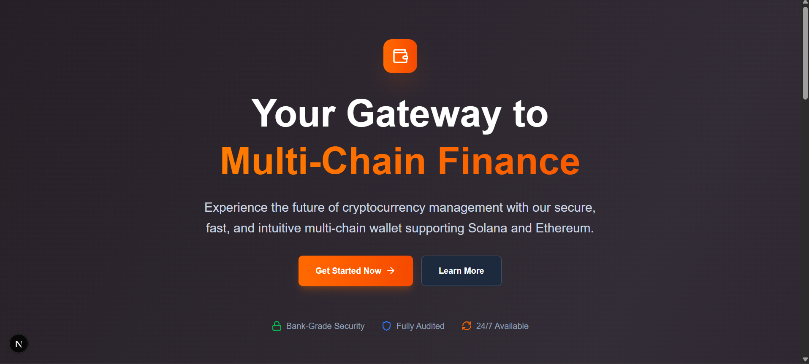
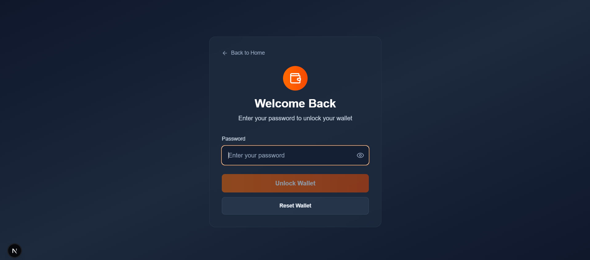
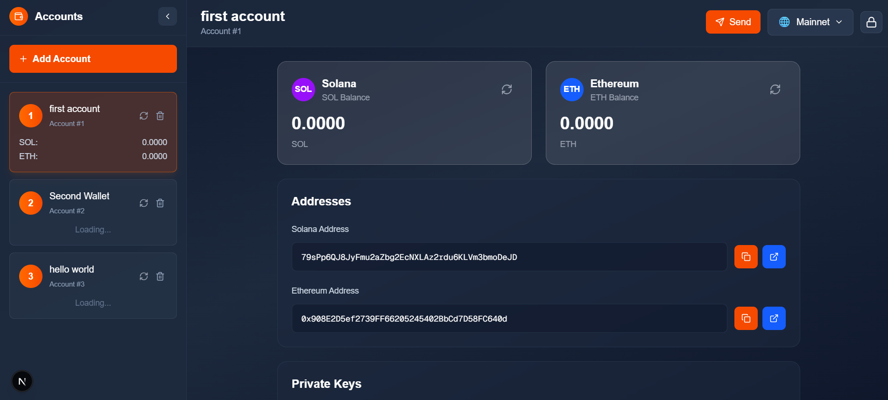

# Multi-Chain Crypto Wallet (Solana & Ethereum)

## 📱 Application Screenshots


  


## 🚀 Overview

This is a sophisticated multi-chain cryptocurrency wallet application built with Next.js that supports both Solana and Ethereum blockchains. The wallet implements industry-standard HD (Hierarchical Deterministic) wallet architecture using BIP39 mnemonic phrases and BIP44 derivation paths for secure key management and multi-account support.

## 🔐 Core Cryptographic Concepts

### Mnemonic Seed Phrases (BIP39)
A mnemonic phrase is a human-readable representation of entropy that serves as the master seed for your entire wallet. This application uses 12-word mnemonic phrases generated according to the BIP39 standard.

**How it works:**
- **Entropy Generation**: The application generates 128 bits of cryptographically secure random data
- **Checksum Addition**: A 4-bit checksum is appended, making it 132 bits total
- **Word Mapping**: These 132 bits are divided into 12 groups of 11 bits each, and each group maps to a word from the BIP39 wordlist (2048 words)
- **Seed Derivation**: The mnemonic phrase is combined with an optional passphrase and processed through PBKDF2 to generate a 512-bit master seed

### HD (Hierarchical Deterministic) Wallets (BIP32/BIP44)
HD wallets allow you to generate an unlimited number of private keys from a single master seed in a deterministic way.

**Derivation Path Structure (BIP44):**
```
m / purpose' / coin_type' / account' / change / address_index
```

**For this wallet:**
- **Solana**: `m/44'/501'/0'/0'/{index}` (coin_type 501 for Solana)
- **Ethereum**: `m/44'/60'/0'/0/{index}` (coin_type 60 for Ethereum)

**Benefits:**
- **Single Backup**: One mnemonic phrase backs up all your accounts
- **Deterministic**: Same mnemonic always generates the same keys in the same order
- **Privacy**: Each transaction can use a different address while being controlled by the same master key
- **Organization**: Hierarchical structure allows for organized key management

### Key Derivation Process
1. **Master Seed**: Generated from mnemonic phrase using PBKDF2
2. **Master Private Key**: Derived from master seed using HMAC-SHA512
3. **Chain Code**: Additional entropy for key derivation
4. **Child Keys**: Generated using parent key + chain code + index
5. **Public Keys**: Derived from private keys using elliptic curve cryptography
6. **Addresses**: Generated from public keys using blockchain-specific hashing

## 🛡️ Security Features

### 🔒 Enhanced Encryption (Version 2.0)
- **AES-256-CBC Encryption**: All sensitive data encrypted with industry-standard AES encryption
- **Random Salt Generation**: Each encryption uses a unique 32-byte salt to prevent rainbow table attacks  
- **PBKDF2 Key Derivation**: User passwords strengthened using PBKDF2 with 100,000 iterations
- **Private Key Protection**: All private keys encrypted before storage (no more plain text!)
- **Secure Random Generation**: All cryptographic operations use secure random number generation

### 🚨 Critical Security Upgrade
**IMPORTANT**: This version fixes a critical vulnerability where private keys were stored in plain text in localStorage.

- **Before**: Private keys visible to anyone with device access
- **After**: All private keys encrypted with enterprise-grade security
- **Auto-Migration**: Existing wallets automatically upgraded to secure format

### 🛡️ Security Dashboard
- **Real-time Analysis**: Continuous security monitoring and vulnerability detection
- **Security Score**: 0-100 rating system for overall wallet security  
- **One-Click Auto-Fix**: Automatically resolves critical security issues
- **User Guidance**: Built-in security tips and best practices
- **Emergency Procedures**: Clear guidance for compromised wallet scenarios

### 🔍 Security Indicators
- 🟢 **Secure**: All data properly encrypted with latest security standards
- 🟡 **Warning**: Using legacy encryption that should be upgraded  
- 🔴 **Critical**: Unencrypted data found - immediate action required

### 🔐 Secure Storage
- **Browser Local Storage**: Encrypted data stored locally in the browser
- **No Server Storage**: Private keys never leave your device  
- **Memory Protection**: Sensitive data cleared from memory when possible
- **Password Confirmation**: Critical operations require password verification
- **Automatic Migration**: Seamless upgrade from insecure legacy formats

### 🛠️ Security Best Practices
- **Zero Trust**: Application assumes no external service can be trusted
- **Principle of Least Privilege**: Only necessary permissions are requested
- **Defense in Depth**: Multiple layers of security protection
- **Secure Defaults**: All security features enabled by default
- **User Education**: Comprehensive security guidance and warnings

## 🌐 Multi-Chain Support

### Solana Integration
- **Ed25519 Cryptography**: Uses Ed25519 elliptic curve for Solana keys
- **Base58 Encoding**: Addresses and keys are encoded in Base58 format
- **Network Support**: Mainnet and Devnet environments
- **Balance Queries**: Real-time SOL balance fetching
- **Transaction Support**: Send SOL transactions with fee calculation

### Ethereum Integration  
- **secp256k1 Cryptography**: Uses secp256k1 elliptic curve for Ethereum keys
- **Keccak256 Hashing**: Ethereum addresses derived using Keccak256
- **Network Support**: Mainnet and Sepolia testnet
- **Balance Queries**: Real-time ETH balance fetching via RPC
- **Transaction Support**: Send ETH transactions with gas estimation

## 💼 Wallet Features

### Account Management
- **Multi-Account Support**: Generate unlimited accounts from one mnemonic
- **Account Naming**: Custom names for easy account identification
- **Account Switching**: Quick switching between different accounts
- **Account Import**: Import existing accounts using private keys
- **Account Deletion**: Secure removal of accounts with confirmation

### Transaction Capabilities
- **Send Transactions**: Send SOL and ETH to any valid address
- **Fee Estimation**: Automatic calculation of network fees
- **Transaction History**: View recent transaction details
- **Address Validation**: Prevents sending to invalid addresses
- **Balance Verification**: Ensures sufficient funds before sending

### User Experience
- **Responsive Design**: Works seamlessly on desktop and mobile
- **Dark Theme**: Modern dark UI with orange accent colors
- **Real-time Updates**: Live balance updates and transaction status
- **Copy to Clipboard**: Easy copying of addresses and keys
- **QR Code Support**: QR codes for easy address sharing
- **Backup & Recovery**: Secure mnemonic phrase backup

## 🏗️ Technical Architecture

### Frontend Framework
- **Next.js 15**: React framework with App Router
- **TypeScript**: Type-safe development
- **Tailwind CSS**: Utility-first styling
- **React Context**: State management for wallet data
- **React Hot Toast**: User notifications

### Blockchain Libraries
- **@solana/web3.js**: Solana blockchain interaction
- **ethers.js**: Ethereum blockchain interaction
- **bip39**: Mnemonic phrase generation and validation
- **ed25519-hd-key**: Solana key derivation
- **crypto-js**: Encryption and hashing utilities

### Security Libraries
- **Node.js Crypto**: Native cryptographic functions
- **Buffer**: Binary data manipulation
- **Base58**: Solana address encoding
- **Lucide React**: Secure icon components

## 🚀 Getting Started

### Prerequisites
- Node.js 18 or higher
- npm, yarn, pnpm, or bun package manager

### Installation
```bash
# Clone the repository
git clone https://github.com/Rahul-lalwani-learner/Multi-chain-wallet.git

# Navigate to project directory
cd Multi-chain-wallet

# Install dependencies
npm install
# or
yarn install
# or
pnpm install
```

### API Setup (Required for Transaction History)
To fetch real transaction data, you need to configure an Alchemy API key:

1. **Create Alchemy Account**:
   - Visit [Alchemy Dashboard](https://dashboard.alchemy.com/)
   - Sign up for a free account

2. **Create API Key**:
   - Create a new app for both Ethereum and Solana networks
   - Copy your API key

3. **Environment Configuration**:
   ```bash
   # Copy the example environment file
   cp .env.local.example .env.local
   
   # Edit .env.local and add your API key
   NEXT_PUBLIC_ALCHEMY_API_KEY=your_actual_api_key_here
   ```

4. **Supported Networks**:
   - **Ethereum**: Mainnet and Sepolia testnet
   - **Solana**: Mainnet and Devnet

**Note**: Without an API key, the wallet will display mock transaction data for demonstration purposes.

### Development Server
```bash
# Start development server
npm run dev
# or
yarn dev
# or
pnpm dev

# Open browser
# Navigate to http://localhost:3000
```

### Production Build
```bash
# Create production build
npm run build

# Start production server
npm start
```

## 📱 Application Flow

### First Time Setup
1. **Landing Page**: Beautiful introduction with feature overview
2. **Wallet Creation**: Generate new mnemonic or import existing
3. **Password Setup**: Set master password for encryption
4. **Mnemonic Backup**: Securely backup your recovery phrase
5. **Wallet Ready**: Access your multi-chain wallet dashboard

### Daily Usage
1. **Unlock Wallet**: Enter password to decrypt wallet data
2. **Dashboard**: View balances across all accounts and networks
3. **Account Management**: Create, rename, or delete accounts
4. **Send Transactions**: Transfer SOL or ETH to other addresses
5. **Security Features**: View private keys with password confirmation

### Recovery Process
1. **Import Wallet**: Use existing mnemonic phrase
2. **Password Setup**: Set new password for this device
3. **Account Discovery**: Wallet scans for existing accounts
4. **Full Access**: All previous accounts and balances restored

## 🔧 Configuration

### Environment Variables
```env
NEXT_PUBLIC_ALCHEMY_API_KEY = "..."
```

### Network Configuration
The wallet supports multiple networks:
- **Solana**: Mainnet, Devnet
- **Ethereum**: Mainnet, Sepolia Testnet

## 🛠️ Development

### Project Structure
```
├── app/                    # Next.js app directory
│   ├── page.tsx           # Landing page
│   └── dashboard/         # Wallet dashboard
├── components/            # React components
│   ├── WalletSetup.tsx   # Initial wallet setup
│   ├── WalletUnlock.tsx  # Password unlock screen
│   ├── WalletDashboard.tsx # Main wallet interface
│   └── ...               # Other components
├── contexts/             # React contexts
│   └── WalletContext.tsx # Global wallet state
├── lib/                  # Utility libraries
│   ├── crypto.ts        # Cryptographic functions
│   ├── wallet.ts        # Wallet operations
│   └── storage.ts       # Local storage management
└── public/              # Static assets
```

### Key Components
- **WalletContext**: Manages global wallet state and operations
- **WalletSetup**: Handles mnemonic generation and password setup
- **WalletDashboard**: Main interface for wallet operations
- **BalanceCard**: Displays account balances and transaction options
- **SendTransaction**: Handles transaction creation and broadcasting

## 🔐 Security Considerations

### User Responsibilities
- **Mnemonic Security**: Keep your recovery phrase safe and private
- **Password Strength**: Use a strong, unique password
- **Device Security**: Only use wallet on trusted devices
- **Regular Backups**: Ensure mnemonic phrase is properly backed up
- **Network Awareness**: Be cautious on public networks

### Application Security
- **No Data Transmission**: Private keys never leave your device
- **Encryption at Rest**: All sensitive data encrypted in storage
- **Memory Management**: Sensitive data cleared from memory
- **Input Validation**: All user inputs validated and sanitized
- **Error Handling**: Secure error messages without data leakage

## 🤝 Contributing

We welcome contributions! Please follow these guidelines:

1. Fork the repository
2. Create a feature branch
3. Implement your changes with tests
4. Follow TypeScript and React best practices
5. Submit a pull request with detailed description

### Development Standards
- **Code Quality**: Use TypeScript strict mode
- **Testing**: Write tests for critical functions
- **Documentation**: Document complex algorithms
- **Security**: Follow security best practices
- **Performance**: Optimize for mobile devices

## 📄 License

This project is licensed under the MIT License - see the [LICENSE](LICENSE) file for details.

## ⚠️ Disclaimer

This software is provided for educational and development purposes. Users are responsible for:
- Securing their mnemonic phrases and passwords
- Understanding the risks of cryptocurrency transactions
- Complying with local laws and regulations
- Using the software at their own risk

The developers are not responsible for any loss of funds or security breaches resulting from the use of this software.

## 🆘 Support

For support and questions:
- Create an issue on GitHub
- Check existing documentation
- Review security best practices
- Contact the development team

---

**Built with ❤️ using Next.js, TypeScript, and modern cryptographic standards**
